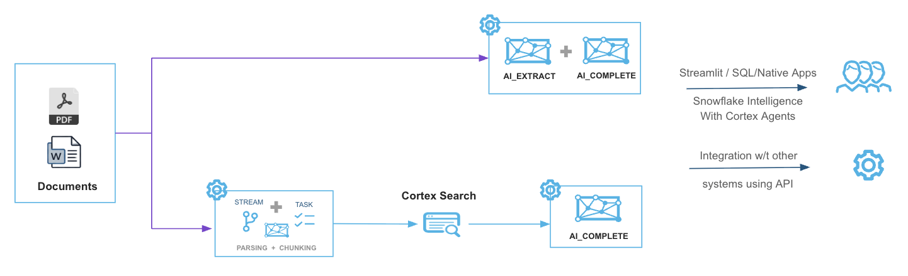
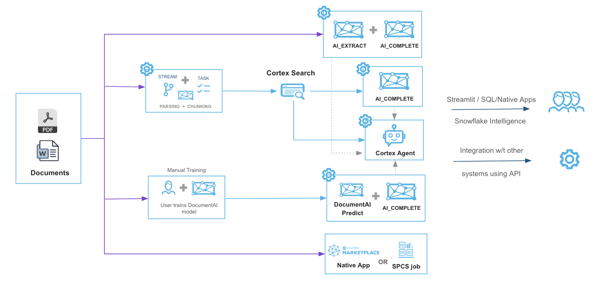

# ❄️ Snowflake Cortex - Document Validation App (Frostlogic)

> **AI-powered contract analysis and validation platform built on Snowflake Cortex

[](https://www.snowflake.com/en/data-cloud/cortex/)
[](https://python.org)
[](https://streamlit.io)

This repo contains a Snowflake-native document validation system that uses **Cortex AI** to intelligently analyze and compare contract documents like Master Service Agreements (MSAs) and Statements of Work (SOWs). It has functionality to add additional document types and has automation to create Cortex Search service automatically. This greatly simplifies onboarding new data sources for business users and allow the documents to be used with Cortex Agents. Built entirely within Snowflake's secure environment, it provides AI-powered insights for contract compliance and validation.


[More videos here](manual.md)


---

## 🎯 Key Features

### 🤖 **AI-Powered Analysis**
- **Multiple AI Models**: Choose from Claude, Llama, Mistral, and more Snowflake Arctic models
- **Smart Document Processing**: Automatic PDF/DOCX parsing and intelligent chunking
- **Semantic Search**: Advanced document search using Snowflake Cortex Search Services
- **Compliance Scoring**: Automated evaluation of contract compliance and alignment

### 📊 **Advanced Analytics**
- **Visual Dashboards**: Interactive charts and metrics for multi-document analysis  
- **Comparison Matrix**: Side-by-side document comparison with compliance scoring
- **Export Options**: Download results as CSV or JSON for further analysis
- **Real-time Processing**: Instant document analysis with live status updates

### 🔧 **Enterprise-Ready**
- **Snowflake Native**: Runs entirely within your Snowflake environment
- **Role-Based Access**: Secure access control using Snowflake RBAC
- **Scalable Processing**: Leverage Snowflake's compute power for large document sets
- **Configuration Management**: Customizable processing workflows and AI model selection

---

## 🏗️ System Architecture
The following architecture diagram depicts how this validation app is architected.


**Core Components:**
- **🗄️ Document Storage**: Snowflake stages for secure file management
- **🔍 AI Processing**: Cortex Search Services and AI_COMPLETE functions  
- **📱 Web Interface**: Streamlit application for document analysis
- **⚙️ Automation**: Tasks and procedures for real-time processing

---

## 🚀 Two Deployment Options

### **Option A: Snow CLI** (DevOps/Automation)
- **Fully automated** one-command deployment
- **CI/CD ready** for production pipelines
- **Reproducible** across environments

### **Option B: Snowsight GUI** (First-Time Users)
- **Visual interface** for step-by-step setup
- **No CLI required** - works entirely in browser
- **Learning friendly** to understand components

---

## 📋 Prerequisites

- ✅ **Snowflake Account** with Cortex AI enabled
- ✅ **ACCOUNTADMIN** access (for initial setup only)  
- ✅ **Enterprise Edition** or higher
- ✅ **Development Tools**: Choose Snow CLI or Snowsight web interface

---

## 📁 Project Structure

```
frostlogic/
├── README.md                 # This file - project overview
├── setup/                    # 🔧 Complete deployment instructions
│   ├── README.md            # Detailed setup guide for both options
│   ├── 00_admin_setup.sql   # Admin prerequisite (ACCOUNTADMIN)
│   ├── 01-08_*.sql          # Database and AI setup scripts
│   └── run_all_setup.sh     # Automated deployment script
├── streamlit/               # 📱 Web application files
│   ├── streamlit_app.py     # Main application
│   ├── environment.yml      # Python dependencies
│   └── pages/               # Multi-page app components
└── sample_docs/             # 📄 Example documents for testing
    ├── msa/                 # Sample Master Service Agreements
    └── sow/                 # Sample Statements of Work
```

---

## 🎯 Use Cases

### **Contract Compliance**
- **MSA vs SOW Validation**: Ensure Statements of Work comply with Master Service Agreement terms
- **Policy Enforcement**: Automated checking against company contract policies
- **Risk Assessment**: Identify potential compliance gaps and risks

### **Document Analysis**
- **Key Information Extraction**: Pull critical dates, rates, terms, and clauses
- **Multi-Document Comparison**: Analyze multiple contracts simultaneously

### **Process Automation**
- **Bulk Processing**: Handle large volumes of contracts efficiently  
- **Standardization**: Ensure consistent analysis across document types

---

## 📖 Getting Started

Ready to deploy? Choose your preferred method and follow the complete setup guide:

## 📁 **[📖 Complete Setup Instructions →](setup/README.md)**

The setup directory contains:
- **Detailed step-by-step instructions** for both deployment options
- **Prerequisites and troubleshooting** guides  
- **All setup scripts** and configuration files
- **Verification procedures** to ensure successful deployment

---

## 🆘 Support & Resources

- 📚 **[Setup Guide](setup/README.md)** - Complete deployment instructions
- 📖 **Snowflake Docs** - [Cortex AI Documentation](https://docs.snowflake.com/en/user-guide/snowflake-cortex/llm-functions)

**⚠️ Important Notice:** This project is provided "as is" without official support from Snowflake Inc. It is not an official Snowflake product and is not covered by Snowflake's standard support agreements.

## Big Picture
Here is a reference architecture for all the availabe options for processing documents in Snowflake using Generative AI.  
  



---

Developed with AI assistance from [Cursor](https://cursor.com). 